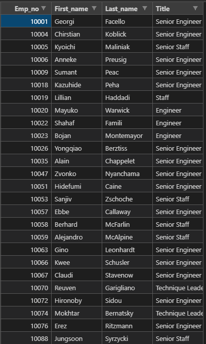
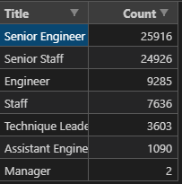
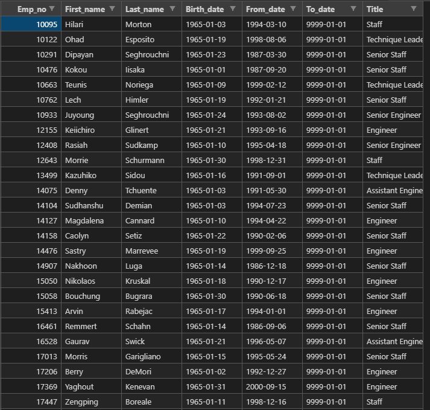
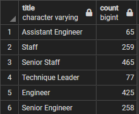

# Pewlett-Hackard-Analysis

## Overview of the analysis
This analysis was aimed at helping our company prepare for a "silver tsunami" of employees who may retire very soon. This was achieved looking for number of people that are eligible for retirement. First, we filtered through the employee databases to create a summary table with a list of every name and current title of each employee who is eligible (currently employed and born between 1952 and 1955).

We created another summary table listing how many employees are retirement eligible in each department.

Finally, we created another summary table that identifies and lists each employee that would be eligible to participate in a mentorship program (current employees who were born between January 1, 1965 and December 31, 1965).
## Results

* A list of employees with their employee number and title was generated
  

* In the future, senior engineers and staff will make up most of our retiring class
  * We will need to prepare for this by hiring new engineers and staff and subsequently training current engineers and staff to take senior positions.
* A mentorship program will help train employees to take senior level positions and onboard new hires

* A list of employees that are qualified was generated
* Many qualified employees are senior engineers and staff, which are the titles in most need of mentoring.

* There are many employees that are available to help by being mentors. However, we may need more. For instance, there are about 25,000 possible retiring senior engineer positions, and only about 250 possible mentors for that title. This is a ratio of 1:100 mentors to possible missing positions.

## Summary

There are about 72,000 positions that will need filling in the next few years as the "silver tsunami" makes an impact. Most of those roles are senior engineer and staff. Our mentorship program needs looking at, as the ratio of mentors to retiring positions is very high for several titles such as senior engineer (1:100).